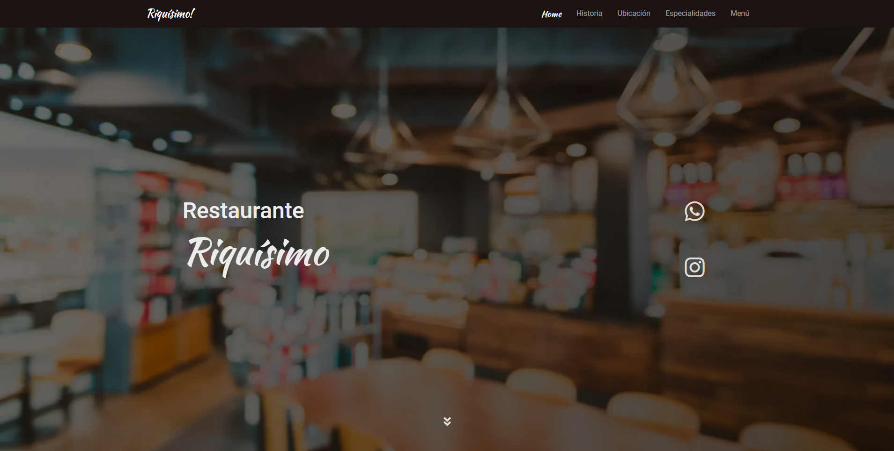

# Restaurante RIQUISIMO - Desarrollo Web

Bienvenido al mi proyecto final del curso [Desarrollo Web](https://www.coderhouse.com/online/desarrollo-web-online) de Coderhouse.

## Tabla de contenidos

- [Resumen](#Resumen)
  - [De que trata el proyecto](#El-proyecto)
  - [Screenshot](#screenshot)
  - [Links](#Tecnologias-utilizadas)
  - [Construcción](#Construcción)
- [Sobre mi](#Sobre-mi)

## Resumen

### El proyecto

Fue un proyecto muy retador, en el cual trate de plasmar lo mas posible los conocimientos que obtuve en el cursado, desde el HTML, pasando por SCC, Sass y Boostrap y la posterior subida a Github y al servidor Webhost.

El resultado final es una landing page minimalista, con colores e imagenes agradables a la vista y la posibilidad de ampliar el contenido a futuro.

### Screenshot

### Tecnologias utilizadas

- Etiquetas semanticas de HTML5
- Metodología Mobile-first 
- Bootstrap
- Flexbox
- CSS Grid
- Sass
- Search Engine Optimization (SEO)
- Git y Github

## Agradecimiento

No quiero dejar pasar la oportunidad para dejar mis saludos para el profe [Lauta](https://www.linkedin.com/in/lautaromontana/), que siempre con la mejor onda nos brindo todos sus conocimientos y tips. A el mejor tutor [Nico Cuello](https://www.linkedin.com/in/nicol%C3%A1s-gabriel-cuello-2936071b4/), que estuvo presente ante cada duda y a mis compañeros que hicieron que este curso sea mucho mas llevadero y divertido. Gracias!❤️🙌

## Sobre mi

- Estemos en contacto! - [Linkedin](https://www.linkedin.com/in/nirodriguez/)

# Muchas gracias!!
